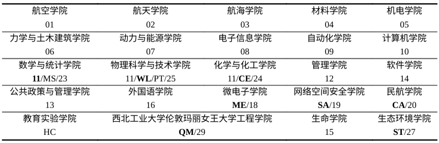

# Q2. 我在确认被录取后是否应该加入学校的迎新群？怎么加入？

新生入学统一在西北工业大学长安校区。航空，材料，机电，QM的材料部分在大三可能搬回友谊校区，部分专业本科做毕业设计时会前往太仓智慧港。在夏季学期也可选择修读某些开设在太仓智慧港的课程，短暂体验。

**题外话，关于各学院的编号问题**，参见附件1：《2024年攻读全日制硕士学位研究生招生专业目录》。例如：

不过，对于编号在10之后的学院，这不是绝对的，例如11可能代指理学院中的任意一个。

其他的特殊代号：
 - HA 黄玉珊航空班
 - FT 陈士橹飞天班
 - HY 黄震中海洋班
 - GF 航空航天强基班
 - MS 数学强基班
 - LY 动能凌云班

DL 是“大类”的意思，包括绝大部分学院大一本科生。
