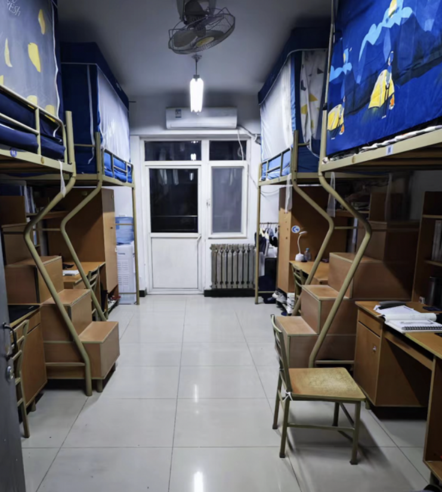
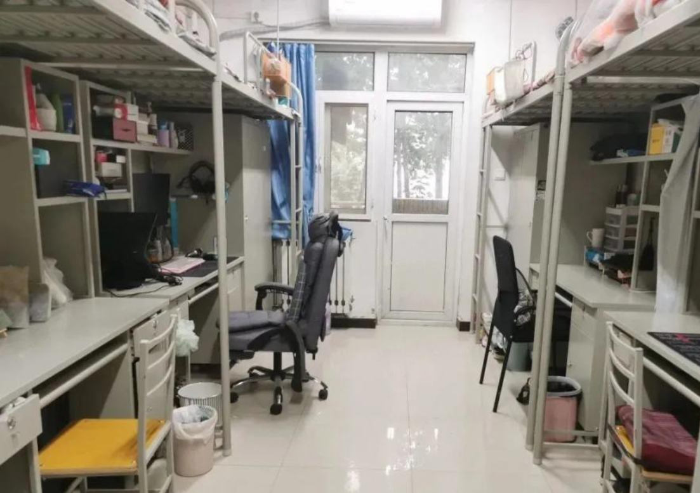

# Q6. 学校的宿舍是什么样的？床铺尺寸是什么样的？

长安校区目前投入使用的宿舍楼分为星天苑A-H座、云天苑A-F座、海天苑，宿舍楼除了不住本科生的星H以外整体呈“U”字形。

星天苑C-G座、云天苑A-D座、海天苑2号楼格局一致，均为四人间，上床下桌，带一个独立阳台，无独立卫浴，在每一层楼都有独立的厕所和洗澡间（隔间）。

星天苑A-B座为四室一厅两卫结构，大套间内有A、B、C、D四个四人间，上下铺，配备独立书桌，无独立卫浴。

云天苑E-F座为两室一厅两卫结构，大套间内有A、B两个四人间，上床下桌，带一个独立阳台，有独立卫浴。

星天苑B座，云天苑A-B座为女生宿舍，星天苑A座，云天苑F座为男女混寝，其余均为男生宿舍。

大部分新生大概率会是这种（星和云）：

海天苑：

