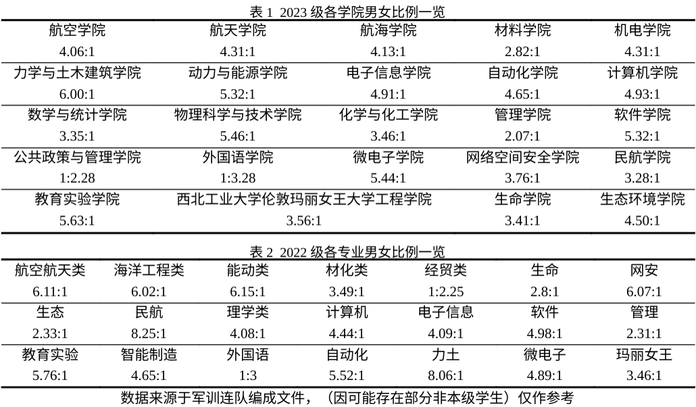

# Q3. 学校的男女比例是怎么样的？

根据我校2023年军训连队编成文件显示，2023级军训共有3536名男生参训，981名女生参训，男女比例约为3.60:1。此数据大致可以反映学校2023级的男女比例情况。

根据我校2022年军训连队编成文件显示，2022级军训共有3469名男生参训，881名女生参训，男女比例约为3.94:1。此数据大致可以反映学校2022级的男女比例情况。

根据我校2021年军训连队编成文件显示，2021级军训共有3324名男生参训，912名女生参训，男女比例约为3.64:1。此数据大致可以反映学校2021级的男女比例情况。

<!--  -->

2023级各学院男女比例一览：

|                 学院                 | 男女比例 |
| :----------------------------------: | :------: |
|               航空学院               |  4.06:1  |
|               航天学院               |  4.31:1  |
|               航海学院               |  4.13:1  |
|               材料学院               |  2.82:1  |
|               机电学院               |  4.31:1  |
|          力学与土木建筑学院          |  6.00:1  |
|            动力与能源学院            |  5.32:1  |
|             电子信息学院             |  4.91:1  |
|              自动化学院              |  4.65:1  |
|              计算机学院              |  4.93:1  |
|            数学与统计学院            |  3.35:1  |
|          物理科学与技术学院          |  5.46:1  |
|            化学与化工学院            |  3.46:1  |
|               管理学院               |  2.07:1  |
|               软件学院               |  5.32:1  |
|          公共政策与管理学院          |  1:2.28  |
|              外国语学院              |  1:3.28  |
|              微电子学院              |  5.44:1  |
|           网络空间安全学院           |  3.76:1  |
|               民航学院               |  3.28:1  |
|             教育实验学院             |  5.63:1  |
| 西北工业大学伦敦玛丽女王大学工程学院 |  3.56:1  |
|               生命学院               |  3.41:1  |
|             生态环境学院             |  4.50:1  |

2022级各专业男女比例一览：

|    学院    | 男女比例 |
| :--------: | :------: |
| 航空航天类 |  6.11:1  |
| 海洋工程类 |  6.02:1  |
|   能动类   |  6.15:1  |
|   材化类   |  3.49:1  |
|   经贸类   |  1:1.25  |
|    生命    |  2.8:1   |
|    网安    |  6.07:1  |
|    生态    |  2.33:1  |
|    民航    |  8.25:1  |
|   理学类   |  4.08:1  |
|   计算机   |  4.44:1  |
|  电子信息  |  4.09:1  |
|    软件    |  4.98:1  |
|    管理    |  2.31:1  |
|  教育实验  |  5.76:1  |
|  智能制造  |  4.65:1  |
|   外国语   |   1:3    |
|   自动化   |  5.52:1  |
|    力土    |  8.06:1  |
|   微电子   |  4.89:1  |
|  玛丽女王  |  3.46:1  |

数据来源于军训连队编成文件，（因可能存在部分非本级学生）仅作参考。

::: info 注意
男女比例与你能否找到对象没有任何关系。
:::